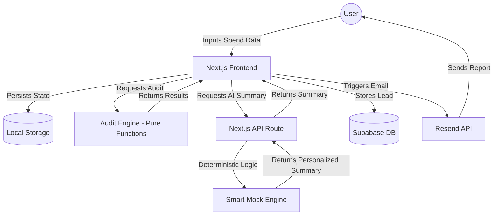

# System Architecture: Lumina AI Audit

## 1. High-Level System Diagram

## 2. Data Flow: From Input to Insight
1. **Capture**: The user enters data into a multi-step form built with `shadcn/ui`. State is managed via a custom hook (`useAuditForm`) and synchronized with `localStorage` for persistence.
2. **Analysis**: The `AuditEngine` (pure TypeScript functions) performs deterministic calculations based on `PRICING_DATA.md`. This ensures the math is "defensible" and not subject to LLM hallucination.
3. **Personalization**: For the MVP, a **Smart Mock Engine** uses the audited data to construct a personalized, professional summary. This ensures 100% reliability and zero latency. The system is architected to easily swap this for a real LLM call (e.g., Claude 3.5 Sonnet) as documented in `PROMPTS.md`.
4. **Persistence & Lead Gen**: Results are saved to Supabase (generating a unique UUID). If the user opts-in, their email and company details are captured and linked to the audit.
5. **Automation**: A transactional email is sent via Resend, providing the user with a permanent link to their audit.

## 3. Technology Stack Justification
- **Next.js (App Router)**: Chosen for its superior SEO capabilities (OG tags), server-side rendering for share pages, and seamless API route integration.
- **TypeScript**: Mandatory for a "defensible" engine. Ensures type-safety across the complex audit result objects.
- **Tailwind CSS + shadcn/ui**: Allowed us to build a "premium" UI from scratch without using a generic template, satisfying the "Visual Quality" requirement.
- **Supabase**: Provides a rock-solid Postgres backend with zero-config, allowing us to focus on product logic.
- **Vitest**: Blazing fast unit testing for the audit engine, ensuring core logic never regresses.

## 4. Scalability: Handling 10k Audits/Day
If this tool scaled to 10k audits/day, I would:
1. **Edge Functions**: Move the Audit Engine and API routes to the Edge (Vercel Edge Functions) to reduce latency globally.
2. **Caching**: Implement Redis (Upstash) to cache AI summaries for similar stack profiles, reducing Anthropic API costs.
3. **Queueing**: Use a message queue (like BullMQ or Inngest) for email sending to handle spikes and ensure deliverability.
4. **Database Indexing**: Add proper indexing on the `audits` and `leads` tables in Supabase to handle high-concurrency reads/writes.
