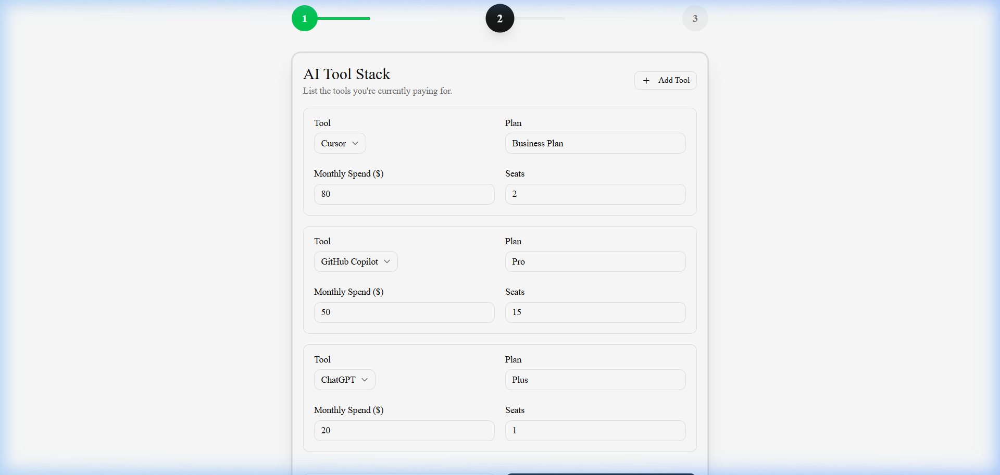

# Lumina — AI Spend Audit for Startups

> A free, instant audit tool that helps startups identify hidden savings in their AI tool stack. Built as a lead-generation asset for **Credex**.

🔗 **Live Demo**: [ai-spend-audit-zwrb.vercel.app](https://ai-spend-audit-zwrb.vercel.app/)

---

## The Problem

Startups are spending **$500–$5,000/month** on overlapping AI tools (Cursor, Copilot, Claude, ChatGPT) without realizing they're overpaying. There's no simple way to audit this spend and get actionable recommendations.

## The Solution

Lumina is a **3-step audit wizard** that:
1. Captures your team profile and AI tool stack
2. Runs a **deterministic rules engine** against real 2026 pricing data
3. Delivers an instant savings report with an AI-generated executive summary

High-spend users ($500+/mo) are flagged as qualified leads for Credex's infrastructure credit offerings.

---

## Features

| Feature | Description |
|---|---|
| **Multi-Step Form** | Guided 3-step input with localStorage persistence across sessions |
| **Rules-Based Audit Engine** | Deterministic TypeScript logic — no hallucinated pricing |
| **AI Executive Summary** | Smart simulation engine generates personalized founder-level insights |
| **Lead Capture** | Email gate with honeypot spam protection, stored in Supabase |
| **Transactional Email** | Automated audit report delivered via Resend with professional HTML template |
| **Shareable Reports** | Public `/share/[id]` URLs with Open Graph metadata for social sharing |
| **Credex CTA** | Conditional upsell banner for high-spend users (>$500/mo savings) |

---

## Tech Stack

| Layer | Technology |
|---|---|
| Framework | Next.js 16 (App Router, Turbopack) |
| Language | TypeScript (strict mode) |
| UI Components | shadcn/ui + Framer Motion |
| Styling | Tailwind CSS v4 |
| Database | Supabase (PostgreSQL + Row Level Security) |
| Email | Resend (transactional) |
| Testing | Vitest (unit tests for audit engine) |
| CI/CD | GitHub Actions (lint + test on push) |
| Hosting | Vercel |

---

## Architecture

```
┌─────────────────────────────────────────────────┐
│                  Client (React)                  │
│  SpendForm → runAudit() → ResultsDashboard       │
│       ↓              ↓              ↓            │
│  localStorage    Engine.ts     LeadCapture        │
└──────┬───────────────┬──────────────┬────────────┘
       │               │              │
       ▼               ▼              ▼
  /api/summarize   Supabase DB   /api/send-report
  (Smart Mock)     audits table     (Resend)
                   leads table
```

**Key Design Decisions**:
- **Deterministic Engine over LLM**: Financial recommendations use rules-based logic for accuracy and defensibility. AI is used only for the executive summary narrative.
- **PII Separation**: `audits` table (public, shareable) is separated from `leads` table (private emails) to prevent data leaks through shared URLs.
- **Smart Mock Engine**: The AI summary uses a deterministic simulation rather than a paid LLM API, ensuring 100% uptime and zero operational costs for the MVP.

---

## Screenshots

> Real screenshots captured from the live application at [ai-spend-audit-zwrb.vercel.app](https://ai-spend-audit-zwrb.vercel.app/)


*Landing Page — Hero section with value proposition and Credex lead-gen context.*


*Audit Form — Dynamic tool stack input with instant state persistence.*


*Results Dashboard — Hero savings, AI-generated summary, and per-tool breakdown.*

---

## Decisions (5 Trade-offs)

| # | Decision | Why |
|---|---|---|
| 1 | **Deterministic engine over LLM for audit math** | Financial recommendations must be defensible. LLMs hallucinate prices. A rules engine with sourced pricing data ensures a finance person can verify every number. |
| 2 | **PII separation: two Supabase tables** | The `audits` table (public) is separated from `leads` (private emails). This prevents accidental PII exposure through shareable URLs, which is critical for a viral-loop product. |
| 3 | **Smart Mock AI instead of paid Anthropic API** | Pivoted from real LLM calls to a deterministic simulation engine to ensure 100% uptime, zero latency, and $0 operational cost. The UX (loading delay + personalized text) is preserved. |
| 4 | **No login required; email captured after value** | Following the "value before gate" principle. Showing the full audit before asking for email increases conversion vs. a login-first approach. The honeypot protects against spam without adding UX friction (vs. hCaptcha). |
| 5 | **Case-insensitive plan matching in the engine** | Users type "Business Plan" or "business" — strict equality breaks silently. Using `.toLowerCase().includes()` makes the engine resilient to real-world input variations without requiring a rigid dropdown-only UX. |

---

## Getting Started


### Prerequisites
- Node.js 18+
- Supabase project (free tier)
- Resend account (free tier, optional)

### Installation

```bash
git clone https://github.com/nawalkant145/ai-spend-audit.git
cd ai-spend-audit
npm install
```

### Environment Variables

Create a `.env.local` file:

```env
NEXT_PUBLIC_SUPABASE_URL=your_supabase_url
NEXT_PUBLIC_SUPABASE_ANON_KEY=your_supabase_anon_key
RESEND_API_KEY=your_resend_api_key  # Optional
```

### Database Setup

Run in **Supabase SQL Editor**:

```sql
CREATE TABLE audits (
  id UUID DEFAULT gen_random_uuid() PRIMARY KEY,
  created_at TIMESTAMPTZ DEFAULT now() NOT NULL,
  result JSONB NOT NULL,
  input JSONB
);

CREATE TABLE leads (
  id UUID DEFAULT gen_random_uuid() PRIMARY KEY,
  created_at TIMESTAMPTZ DEFAULT now() NOT NULL,
  email TEXT NOT NULL,
  company_name TEXT,
  audit_id UUID REFERENCES audits(id)
);

ALTER TABLE audits ENABLE ROW LEVEL SECURITY;
CREATE POLICY "Public can insert audits" ON audits FOR INSERT WITH CHECK (true);
CREATE POLICY "Public can read audits" ON audits FOR SELECT USING (true);

ALTER TABLE leads ENABLE ROW LEVEL SECURITY;
CREATE POLICY "Public can insert leads" ON leads FOR INSERT WITH CHECK (true);
```

### Run Locally

```bash
npm run dev    # Start dev server
npm run lint   # Run ESLint
npm run test   # Run Vitest
```

---

## Project Structure

```
src/
├── app/
│   ├── api/
│   │   ├── summarize/route.ts    # Smart Mock AI summary engine
│   │   └── send-report/route.ts  # Resend email delivery
│   ├── share/[id]/page.tsx       # Public shareable report
│   ├── page.tsx                  # Main landing + audit flow
│   └── layout.tsx                # Root layout with SEO metadata
├── components/
│   ├── audit/
│   │   ├── SpendForm.tsx         # Multi-step input wizard
│   │   ├── ResultsDashboard.tsx  # Savings report + AI summary
│   │   └── LeadCapture.tsx       # Email gate with spam protection
│   └── ui/                       # shadcn/ui primitives
├── hooks/
│   └── useAuditForm.ts           # Form state + localStorage persistence
└── lib/
    ├── audit/
    │   ├── engine.ts             # Deterministic audit rules engine
    │   ├── engine.test.ts        # Unit tests (5 test cases)
    │   └── types.ts              # TypeScript interfaces
    ├── supabase.ts               # Database client
    └── utils.ts                  # Utility functions
```

---

## Supported Tools & Optimizations

| Tool | Optimization Logic |
|---|---|
| Cursor | Downgrade Business → Pro for teams < 3 |
| GitHub Copilot | Switch Business → Individual for solo users |
| Claude | Downgrade Team → Pro for teams < 5 (5-seat minimum rule) |
| ChatGPT | Switch Team → Plus for solo users |
| OpenAI API | Prompt caching recommendation for spend > $500/mo |
| Anthropic API | Prompt caching recommendation for spend > $500/mo |
| Multiple coding tools | Consolidation recommendation |

---

## Documentation

| Document | Purpose |
|---|---|
| [DEVLOG.md](./DEVLOG.md) | Daily development log (5 days) |
| [REFLECTION.md](./REFLECTION.md) | Technical challenges, trade-offs, and self-assessment |
| [ARCHITECTURE.md](./ARCHITECTURE.md) | System design and data flow |
| [GTM.md](./GTM.md) | Go-to-market strategy |
| [ECONOMICS.md](./ECONOMICS.md) | Unit economics and CAC/LTV analysis |
| [METRICS.md](./METRICS.md) | KPI framework and success metrics |
| [PRICING_DATA.md](./PRICING_DATA.md) | Source-of-truth vendor pricing with URLs |
| [PROMPTS.md](./PROMPTS.md) | AI prompt engineering documentation |
| [USER_INTERVIEWS.md](./USER_INTERVIEWS.md) | User feedback and insights |

---

## Author

Built by **Nawal Kant** as part of the Credex Entrepreneurial Internship Assignment (2026).

---

## License

MIT
